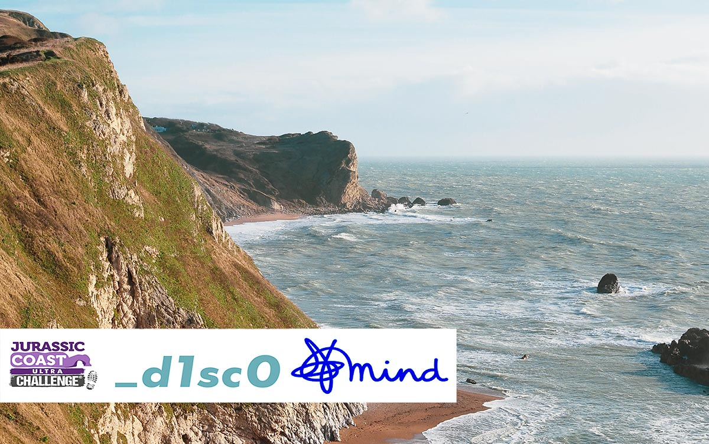

> Update: Challenge succesfully completed! It took me just under 16 hours to complete the 36 mile hike. In total I raised over £1200 for Mind! A massive thank you to all those who donated.

On 18th May 2024 I'll be attempting to complete a **58km hike (36 miles)** along the Jurassic Coast from Corfe Castle to Weymouth. The route includes 1700m of elevation and is the first half of
the full [Jurassic Coast Ultra Challenge](https://www.ultrachallenge.com/jurassic-coast-challenge/) of 100km. I'm taking part to challenge myself physically and to raise funds for the [charity Mind](https://www.mind.org.uk/).

### Why I'm fundraising for Mind

Over the last couple of years, I have suffered through long periods of
acute anxiety. I've also spent time caring for a close family member who
has suffered from severe depression and reached several points of crisis.
This journey has involved navigating the best and the worst of our
National Health Service, hospital stays, and a mix of self-funded care and
therapy. Dealing with these things has at times been complex and the
information provided by Mind has been extremely helpful and a great source
of support.

The work of Mind is important. I'm fundraising to help them in their work
which involves;

- publishing useful, accessible information about mental health illness
- campaigning and lobbying to improve legislation and services
- raising public awareness and understanding of issues
- running a network of mental health support services up and down the
  country

**Poor mental health can impact anybody and the work of Mind can benefit
everybody. Please support me in my challenge and donate to Mind using
the JustGiving page linked below.**

[Donate to my JustGiving page](https://www.justgiving.com/page/disco-jurassic-challenge)

Every donation, however small helps. Thank you!

Stuart x o x
