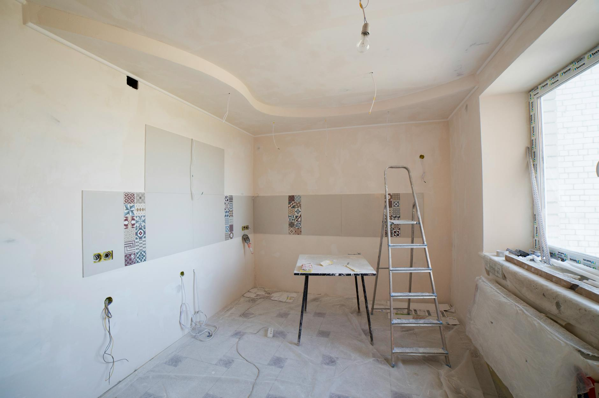

So spring is here and I decided it was time to give this website another fresh coat of paint. What started out as an ambition to just paint the walls turned into knocking a few down and doing some slightly more involved renovations. 

### Motivations for change

The combination of my university studies plus spending more time on little personal projects lately has driven me back to wanting to have a space where I can write about, share and showcase what I'm working on and learning. This is still mostly for my own benefit, as opposed to building or satisfying the needs of an audience - It's just useful to catalog and make connections between things over time. There was nothing substantially wrong with the site as it was in this respect. I was just a little tired of the punk neo-brutalist aesthetic I'd created and wanted something a bit calmer (am I getting old?). I've been interested in this notion of a digital garden and wanted something that was more of this ilk - easier to browse and rummage around - less card, image, magazine like in layout and feel than what I had. 

I also wanted to remove some of the barriers that were stopping me from writing and publishing. This time around that's meant implementing Sveltia CMS (still git-based) for easier and more accessible content editing and generating some scripts to handle some of the manual labour I was putting into generating things like social image previews. 

Along the way I've also had the opportunity to update and simplify some of the codebase, create some documentation and reduce some technical debt from previous experiments. All very satisfying for a nerd like me 🤓.

### Highlights

- one
- two

### Things I'm considering next

- one two

_Image credit: [Valentin Ivantsov on Pexels](https://www.pexels.com/photo/modern-interior-kitchen-under-renovation-36035073/)_
